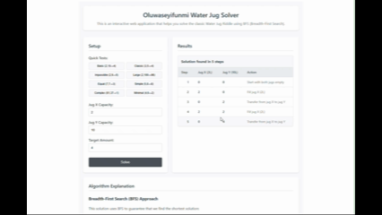

# Water Jug Solver



This is an interactive web application that helps you to solve the classic Water Jug Riddle using BFS (Breadth-First Search). 


## The Challenge

You're given two jugs of specific capacities (X and Y) and a target value (Z). The task is to find the shortest sequence of steps to measure exactly Z liters using only:
- Fill
- Empty
- Pour (transfer from one jug to the other)

This app solves that problem using **BFS (Breadth-First Search)**.


## Features

- Takes custom X, Y, and Z inputs
- Uses **Breadth-First Search (BFS)** to find the shortest solution path
- Displays each step clearly (Fill / Transfer / Empty)
- Detects and handles unsolvable cases

## Tech Stack

- [SvelteKit](https://kit.svelte.dev/)
- TypeScript

## Solution Explanation

The application uses a **Breadth-First Search (BFS)** algorithm to explore all possible states of the jugs. BFS is chosen because it guarantees finding the shortest path to the solution, which is crucial for this problem.

### Greatest Common Divisor (GCD) Theorem

The solution is based on the mathematical properties of the GCD (Greatest Common Divisor):

> **A solution exists if and only if:**
> 1. The target amount Z is divisible by GCD(X, Y)
> 2. Z ≤ max(X, Y)

### BFS Implementation

The BFS algorithm is implemented in the following way:

1. Before attempting to solve, we verify if a solution exists using the GCD theorem
2. BFS explores states level by level, ensuring the first solution found uses the minimum number amount of steps
3. The algorithm explores all possible jug states
4. We maintain a list of visited states set to avoid infinite loops
5. **There are Six Core Operations**:
   - Fill jug X
   - Fill jug Y
   - Empty jug X
   - Empty jug Y
   - Transfer from jug X to jug Y
   - Transfer from jug Y to jug X

> This is implemented in the `solveWaterJug` function in `$lib/solution.ts`, which returns the sequence of steps to reach the target amount Z.

### Why BFS over DFS?

**BFS Advantages**:
- BFS guarantees we find the shortest path possible
- It explores states that are closer to the start first, ensuring the solution is optimal
- Unlike DFS, BFS naturally finds the optimal solution first

### Time Complexity
- **Best Case**: O(1) - when solution is impossible (detected immediately)
- **Average Case**: O(X + Y) - for most solvable cases
- **Worst Case**: O(X × Y) - exploring all possible states

## How to Run the Application

In order to run this application locally, you need to have the following prerequisites:

You need the following installed on your machine:
- Node.js
- pnpm

Once you have the prerequisites, you can then follow these steps to set up and run the application:

1. **Clone the repository**:
   ```bash
   git clone https://github.com/sheyzi/chicks-waterjug-challenge.git
   cd chicks-waterjug-challenge
   ```

2. **Install dependencies**:
   ```bash
   pnpm install
   ```

3. **Start the development server**:
   ```bash
   pnpm dev
   ```

4. **Open your browser** and navigate to `http://localhost:5173`

### Building for Production

```bash
pnpm build
```

The built application will be in the `build` directory.


## Try These Test Cases

| Jug X | Jug Y | Target Z | Solvable | Solution Steps |
|-------|-------|----------|----------|----------------|
| 3     | 5     | 4        | ✅       | 7 steps        |
| 4     | 6     | 5        | ❌       | No Solution    |
| 61    | 37    | 1        | ✅       | 89 steps       |
| 99    | 78    | 3        | ✅       | 49 steps       |


**Live Demo**: [https://chicks-waterjug-challenge.netlify.app/](https://chicks-waterjug-challenge.netlify.app/)
